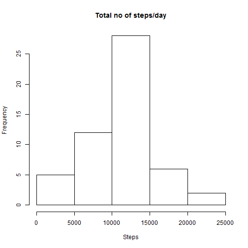
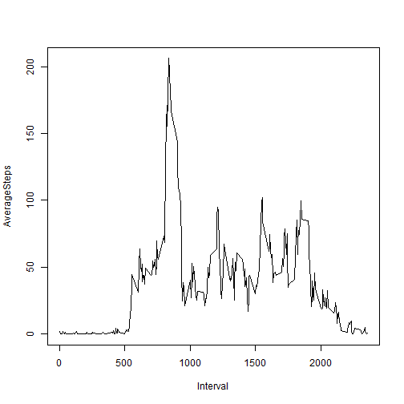
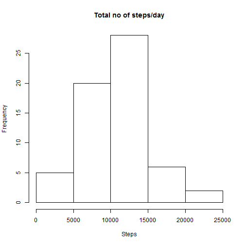
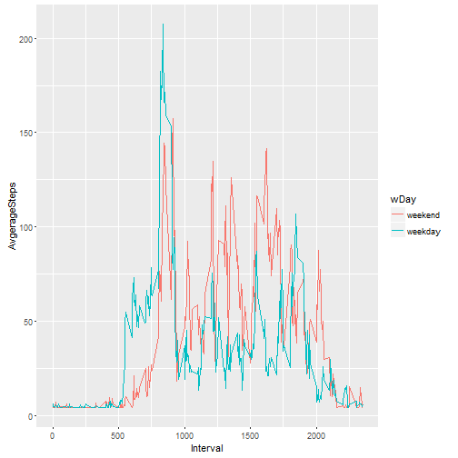

Reproducible Research Course Project 1
===============================================================================
### Loading and proprocessing the data
1. Load the data

```r
activity = read.csv('activity.csv')
```
2. Process/transform the data (if necessary) into a format suitable for your analysis
Find total steps/day


```r
totalSteps = aggregate(steps~date, data=activity, sum, na.rm = T)
```

### What is mean total number of steps taken per day?
1. Make a histogram of the total number of steps taken each day

```r
hist(totalSteps$steps, xlab='Steps',main='Total no of steps/day')
```


2. Calculate and report the mean and median of the total number of steps taken per day

```r
mean(totalSteps$steps)
```

```
## [1] 10766.19
```

```r
median(totalSteps$steps)
```

```
## [1] 10765
```

### What is the average daily activity pattern?
1. Make a time series plot (i.e. type = "l") of the 5-minute interval (x-axis) and the average number of steps taken, averaged across all days (y-axis)

```r
avgIntervalSteps = aggregate(steps~interval, activity,mean)
plot(avgIntervalSteps$interval,avgIntervalSteps$steps,
     type = 'l',
     xlab = 'Interval', ylab = 'AverageSteps')
```


2. Which 5-minute interval, on average across all the days in the dataset, contains the maximum number of steps?

```r
avgIntervalSteps[avgIntervalSteps$steps ==  max(avgIntervalSteps$steps),]
```

```
##     interval    steps
## 104      835 206.1698
```
835th interval

### Imputing missing values
1. Calculate and report the total number of missing values in the dataset (i.e. the total number of rows with NAs)

```r
sum(is.na(activity$steps))
```

```
## [1] 2304
```
2. Devise a strategy for filling in all of the missing values in the dataset, ie.,
find the median of 5-min interval

```r
avgIntervalSteps.median = median(avgIntervalSteps$steps)
```
3. Create a new dataset that is equal to the original dataset but with the missing data filled in.

```r
activity.modified = activity # keeping the original data
activity.modified[is.na(activity.modified)]=avgIntervalSteps.median
```

4. Make a histogram of the total number of steps taken each day and Calculate and report the mean and median total number of steps taken per day. 

```r
totalSteps.modified = aggregate(steps~date, data= activity.modified,sum,na.rm=T)
hist(totalSteps.modified$steps, xlab='Steps',main='Total no of steps/day')
```



```r
mean(totalSteps.modified$steps)
```

```
## [1] 10642.7
```

```r
median(totalSteps.modified$steps)
```

```
## [1] 10395
```
* Do these values differ from the estimates from the first part of the assignment? What is the impact of imputing missing data on the estimates of the total daily number of steps?
* There is little difference between the total number of steps taken each day, mean and median. In this particular case it reduces slightly steps taken, mean and media.
And this depends how you impute data. 
Here I have choose to you use the median of steps taken.

### Are there differences in activity patterns between weekdays and weekends?
1. Create a new factor variable in the dataset with two levels - "weekday" and "weekend" indicating whether a given date is a weekday or weekend day.

```r
myWeekDays = c('Monday', 'Tuesday', 'Wednesday', 'Thursday', 'Friday') # creating vector of weekday
activity.modified$MyDate = as.Date(activity.modified$date) # converting date to a type of Date

# Use `%in%` and `weekdays` to create a logical vector
# onvert to `factor` and specify the `levels/labels`
activity.modified$wDay = factor( (weekdays(activity.modified$MyDate) %in% myWeekDays), 
                                 levels = c(F,T), labels = c('weekend','weekday'))
head(activity.modified)
```

```
##      steps       date interval     MyDate    wDay
## 1 34.11321 2012-10-01        0 2012-10-01 weekday
## 2 34.11321 2012-10-01        5 2012-10-01 weekday
## 3 34.11321 2012-10-01       10 2012-10-01 weekday
## 4 34.11321 2012-10-01       15 2012-10-01 weekday
## 5 34.11321 2012-10-01       20 2012-10-01 weekday
## 6 34.11321 2012-10-01       25 2012-10-01 weekday
```
2. Make a panel plot containing a time series plot (i.e. type = "l") of the 5-minute interval (x-axis) and the average number of steps taken, averaged across all weekday days or weekend days (y-axis).


```r
library(ggplot2)
avgIntervalSteps.modified = aggregate(steps~interval+wDay,activity.modified,mean)
ggplot(avgIntervalSteps.modified, aes(x=interval,y=steps, color=wDay)) +
    geom_line() + 
    ylab('AvgerageSteps') +
    xlab('Interval')
```


There is obivous difference in pattern between weekdays and weekend.
Total steps taken during peak time is lower during weekend.
